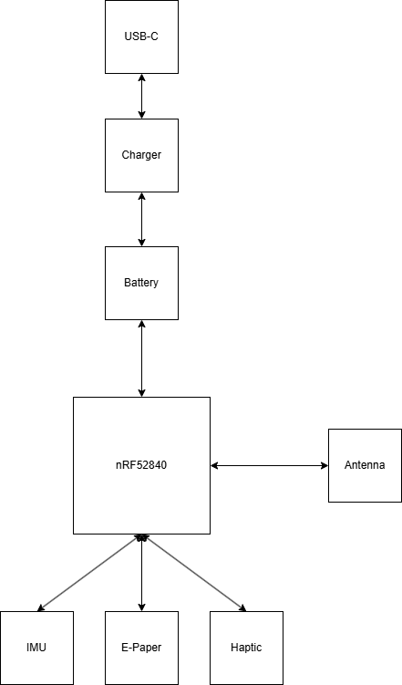

## InkTime

Smartwatch ieftin si open source.

### Power Management

Charger LiPo: BQ25180

Regulator 3.3V: RT6160

Fuel gauge: MAX17048

#### Interfata

I2C (SDA/SCL bus comun)

Pini INT pentru evenimente (PMIC_INT, ALERT)

### Display (e-paper)

Conector FPC pentru display e-paper

Circuit de drive + PFET pentru power gating (VEPD)

#### Interfata

SPI:

SCK -> P0.02

MOSI -> P0.03

CS -> P0.05

Control:

DC -> P0.15

RST -> P0.16

BUSY -> P0.17

### Senzori

IMU (accelerometru): BMA421

#### Interfata

I2C:

SDA -> P0.06

SCL -> P0.07

### Haptic Feedback

DRV2605L

#### Interfata

I2C (bus comun)

Enable:

HAPTIC_EN -> P0.12

### Butoane

Up -> P0.13

Down -> P0.14

Enter -> P1.00

### Interfata
D+ -> USB DP (nRF52840)

D- -> USB DM (nRF52840)

VBUS -> detect pin

### Schematic

Schematicul l-am realizat pe o singura pagina.

Toate rezistentele sunt SMD, in capsula 0201. Toate condensatoarele sunt SMD, cele cu valori mai mici sau egale cu 100nF sunt in capsula 0201, cele cu valori mai mari de 100nF sunt 0402.

Am ignorat erorile de ERC de genul "Power pin X connected to Y" sau "Only one pin on net X".

### PCB

PCB-ul este de tip 2-layer si am facut rutarea pe ambele parti, in timp ce componentele sunt doar pe top.

Am plasat butoanele, usb-c connector si e-paper display connector pentru a se alinia cu marginile corespunzator.

Condensatoarele de decuplare (100nF) au fost plasate cat mai aproape de pinii de alimentare. De asemenea, cristalele au fost plasate cat mai aproape de MCU.

Am izolat antena de restul circuitului, nu am trasat rute pe top / bottom unde se afla si nu am facut "polygon pour" in acea zona. Pad-ul "2" a fost plasat in exterior.

Rutele au grosimea 0.3mm pentru semnalele de tip "POWER" si 0.15mm in rest. In anumite cazuri am scazut grosimea pentru a le putea strecura prin anumite locuri.

M-am ajutat de "escape routing" prin plasarea unui via direct pe pin / pad si inceperea rutarii direct pe bottom.

